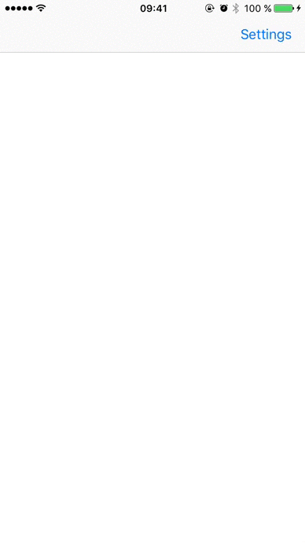

This sample code shows how to use a custom presentation controller to create a custom view controller presentation.

##Sources:

- [developer.apple.com - LookInside: Presentation Controllers, Adaptivity, and Custom Animator Objects](https://developer.apple.com/library/ios/samplecode/LookInside/Introduction/Intro.html#//apple_ref/doc/uid/TP40014643)
- [developer.apple.com - Custom View Controller Presentations and Transitions](https://developer.apple.com/library/content/samplecode/CustomTransitions/Introduction/Intro.html#//apple_ref/doc/uid/TP40015158)
